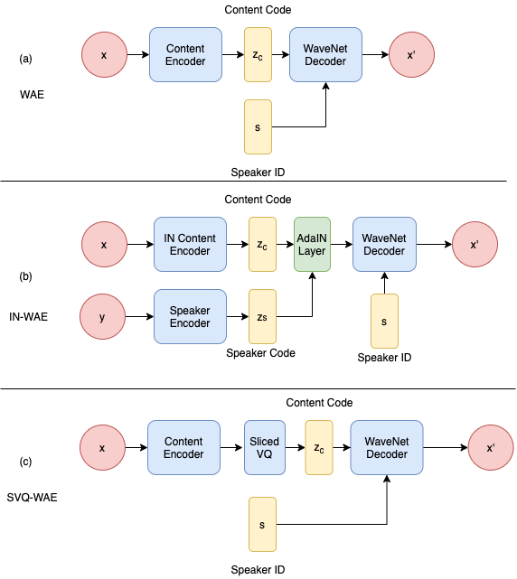

# wavenet\_autoencoders
> Unsupervised representation learning of speech has been of keen interest in recent years, which is for example evident in the wide interest of the ZeroSpeech challenges. This work presents a new method for learning frame level representations based on WaveNet auto-encoders. Of particular interest in the ZeroSpeech Challenge 2019 were models with discrete latent variable such as the Vector Quantized Variational Auto-Encoder (VQVAE). However these models generate speech with relatively poor quality. In this work we aim to address this with two approaches: first WaveNet is used as the decoder and to generate waveform data directly from the latent representation; second, the low complexity of latent representations is improved with two alternative disentanglement learning methods, namely instance normalization and sliced vector quantization. The method was developed and tested in the context of the recent ZeroSpeech challenge 2020. The system output submitted to the challenge obtained the top position for naturalness (Mean Opinion Score 4.06), top position for intelligibility (Character Error Rate 0.15), and third position for the quality of the representation (ABX test score 12.5). These and further analysis in this paper illustrates that quality of the converted speech and the acoustic units representation can be well balanced.

[[This work is a submission to ZeroSpeech Challenge 2020](https://zerospeech.com/2020/results.html)]

[[paper](http://arxiv.org/abs/2008.06892)]

### This work is based on:
 1. [Chorowski' wavenet autoencoder model](https://arxiv.org/abs/1901.08810) 
 2. [wavenet vocoder implementation](https://github.com/r9y9/wavenet_vocoder)

### This work proposes two models: 
 1. WaveNet autoencoder + Instance Normalization (IN-WAE)
 2. WaveNet autoencoder + Sliced Vector Quantization (SVQ-WAE)
 


# Requirements
 1. Python 3.6
 2. PyTorch 0.4.1
 3. tensorboardX
 4. challenge evaluation scripts [rep](https://github.com/bootphon/zerospeech2020)
 5. librosa
 6. scipy

# How to run

## Download data
```bash 
./bin/download_dataset.sh
```

Unzip the dataset requires 7z (>16.04) and password

## create conda env and install pkgs
```bash
conda create --name torch_0.4 python==3.6
source activate torch_0.4
conda install -c conda-forge librosa
conda install pytorch=0.4.1 cuda90 -c pytorch
pip install tensorboardX wavenet_vocoder
```


## Preprocessing
```bash
./bin/run_pre.sh data_root
```
e.g.
```bash
./bin/run_pre.sh 2020/2019
```

## Train
 * train VQ-WAE model
    
    ```bash ./bin/vqwae_train.sh exp_name hps language```
    
    e.g. ```bash ./bin/vqwae_train.sh exp_name hps/vqwae.json english```
 
## Inference for ABX evaluation
 * inference VQ-WAE model
 	
